# Açaí + Sabor — pedidos e gestão

[](https://acai-mais-sabor-santa-fe.nexus7devstudio.chatgpt.site)
[](https://acai-mais-sabor-santa-fe.nexus7devstudio.chatgpt.site/admin/login)

Sistema de pedidos da Açaí + Sabor, em Santa Fé do Sul. O cliente pode escolher um combinado ou montar o próprio copo, revisar o carrinho, informar entrega/pagamento e acompanhar o pedido por um código. A equipe opera pedidos, cardápio, adicionais, promoções, finanças, horários e integrações em um painel protegido.

> As imagens abaixo são capturas do sistema para documentação. Carrinho, checkout e pedido usam dados demonstrativos; nenhum dado de cliente foi incluído.

## Galeria de telas

### Cliente

| Início — computador | Início — celular |
| --- | --- |
| 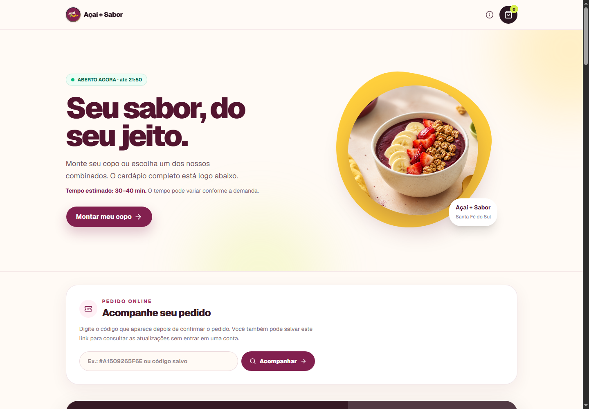 |  |

| Monte seu copo — computador | Monte seu copo — celular |
| --- | --- |
| 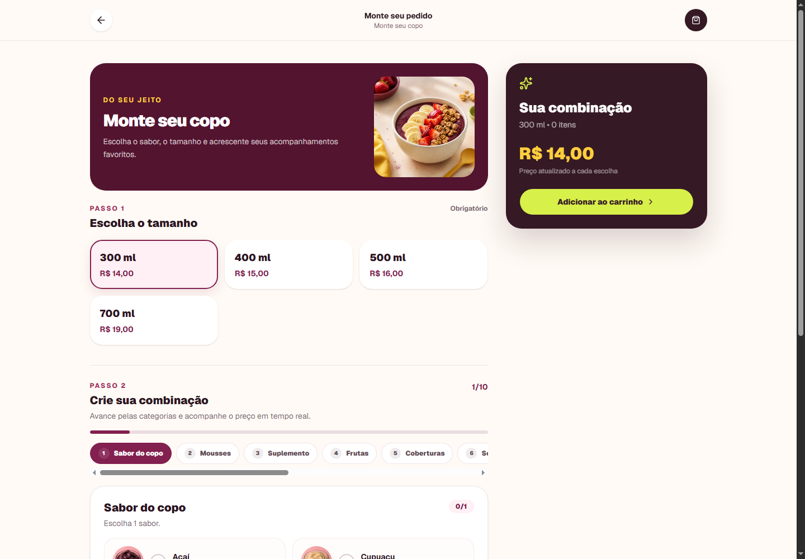 | 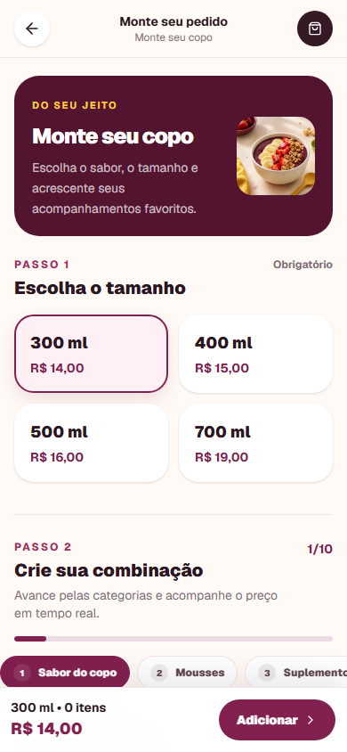 |

| Carrinho | Checkout |
| --- | --- |
| 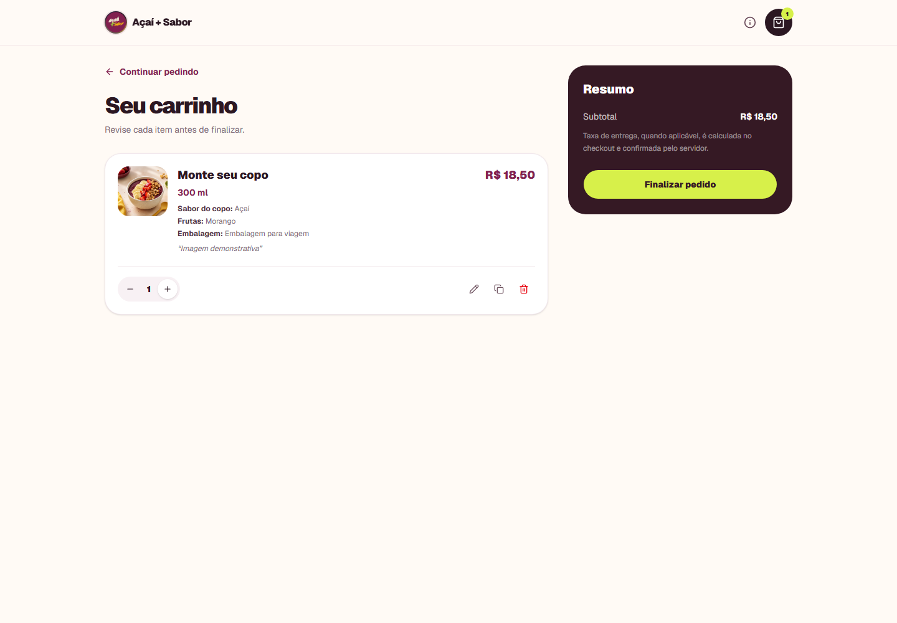 | 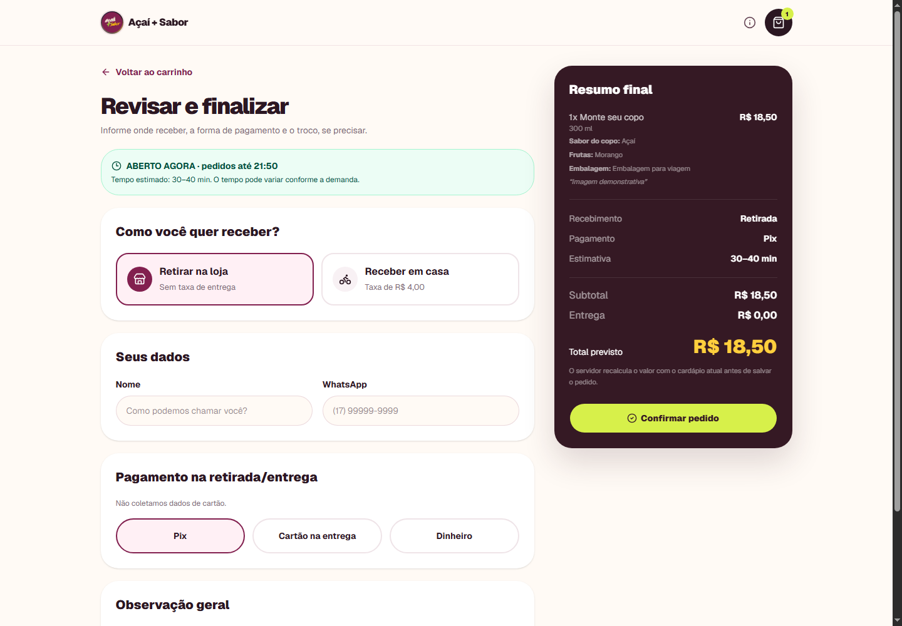 |

| Acompanhamento por código | Informações da loja |
| --- | --- |
| 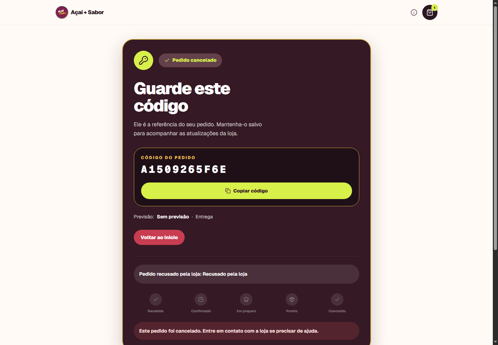 | 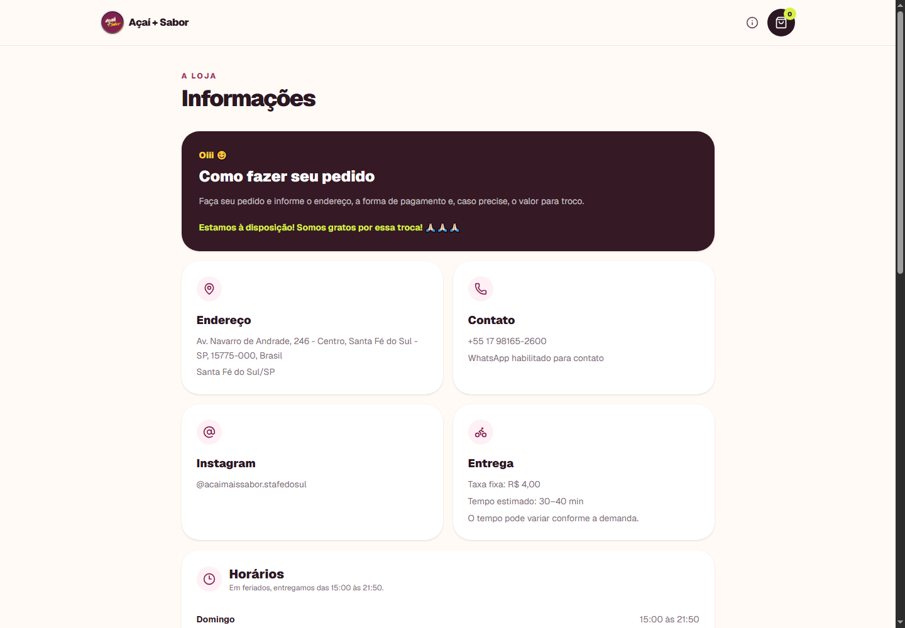 |

### Gestão

| Login administrativo | Pedido operacional |
| --- | --- |
| 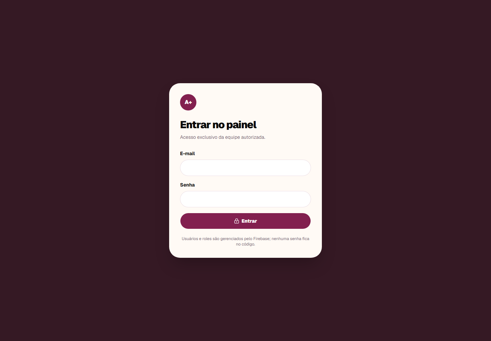 | 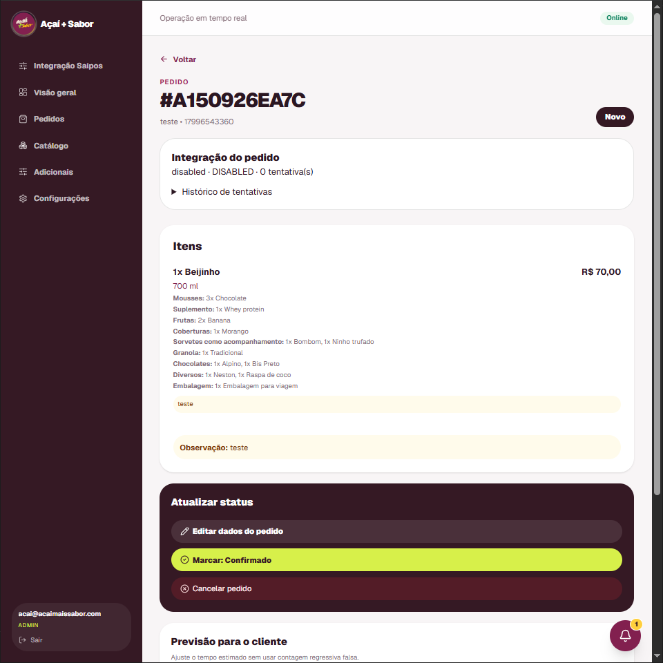 |

| Catálogo | Configurações |
| --- | --- |
| 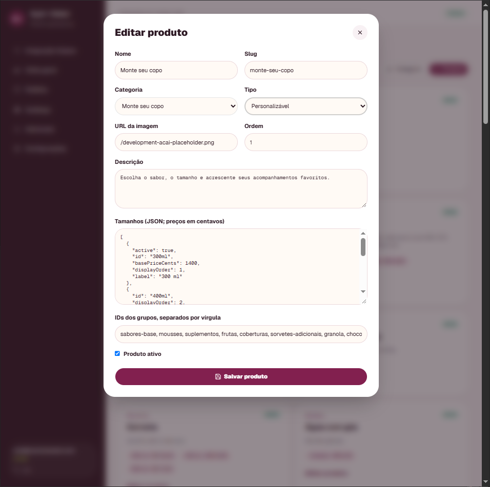 | 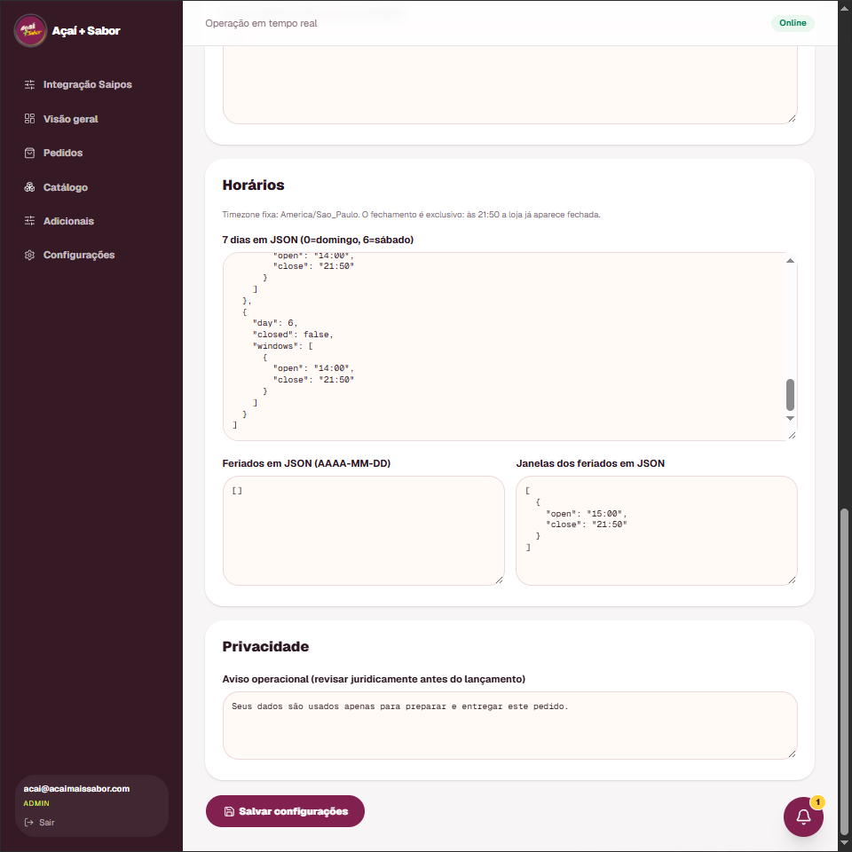 |

## Rotas do sistema

| Área | Rota | Para que serve |
| --- | --- | --- |
| Cardápio | [`/`](https://acai-mais-sabor-santa-fe.nexus7devstudio.chatgpt.site/) | Página inicial, combinados, categorias e busca de pedido. |
| Montagem | `/montar/:produto` | Escolha de tamanho, sabor, adicionais, observação e preço atualizado. |
| Carrinho | [`/carrinho`](https://acai-mais-sabor-santa-fe.nexus7devstudio.chatgpt.site/carrinho) | Revisão, quantidade, duplicação, remoção e edição de itens. |
| Checkout | [`/checkout`](https://acai-mais-sabor-santa-fe.nexus7devstudio.chatgpt.site/checkout) | Retirada/entrega, dados de contato, pagamento, troco e confirmação. |
| Pedido | `/pedido/:codigo` | Código copiável, status, previsão e aceite de alterações da loja. |
| Informações | [`/informacoes`](https://acai-mais-sabor-santa-fe.nexus7devstudio.chatgpt.site/informacoes) | Contato, endereço, horários e políticas da loja. |
| Login | [`/admin/login`](https://acai-mais-sabor-santa-fe.nexus7devstudio.chatgpt.site/admin/login) | Entrada exclusiva da equipe autorizada. |
| Visão geral | [`/admin`](https://acai-mais-sabor-santa-fe.nexus7devstudio.chatgpt.site/admin) | Atalhos de operação e notificações de pedidos. |
| Pedidos | [`/admin/pedidos`](https://acai-mais-sabor-santa-fe.nexus7devstudio.chatgpt.site/admin/pedidos) | Fila por status, busca, aceite, recusa, edição e previsão. |
| Detalhe do pedido | `/admin/pedidos/:id` | Edição de cliente, itens, total e mensagens para aceite do cliente. |
| Catálogo | [`/admin/catalogo`](https://acai-mais-sabor-santa-fe.nexus7devstudio.chatgpt.site/admin/catalogo) | Produtos, fotos, tamanhos, preços e disponibilidade. |
| Adicionais | [`/admin/adicionais`](https://acai-mais-sabor-santa-fe.nexus7devstudio.chatgpt.site/admin/adicionais) | Grupos, limites, opções e adicionais premium. |
| Promoções | [`/admin/promocoes`](https://acai-mais-sabor-santa-fe.nexus7devstudio.chatgpt.site/admin/promocoes) | Criação, vigência e ativação de ofertas. |
| Finanças | [`/admin/financas`](https://acai-mais-sabor-santa-fe.nexus7devstudio.chatgpt.site/admin/financas) | Vendas, despesas, saldo e lançamentos em reais. |
| Configurações | [`/admin/configuracoes`](https://acai-mais-sabor-santa-fe.nexus7devstudio.chatgpt.site/admin/configuracoes) | Dados da loja, entrega, horários, feriados e privacidade. |
| Integração Saipos | [`/admin/integracao`](https://acai-mais-sabor-santa-fe.nexus7devstudio.chatgpt.site/admin/integracao) | Configuração e diagnóstico da integração, sem remover a operação própria. |

## Como o pedido funciona

1. O cliente monta o açaí e confirma os dados no checkout.
2. O sistema cria um código seguro de acompanhamento e salva o pedido no Firestore.
3. A loja recebe uma notificação no painel e pode aceitar, editar ou recusar.
4. Se a loja editar itens ou valor, o pedido retorna ao cliente para aceite antes da confirmação.
5. O cliente acompanha: recebido, confirmado, em preparo, pronto, saiu para entrega e concluído.

## Tecnologia e operação

- React, TypeScript, Vinext/Vite e Tailwind, com layout responsivo para celular e computador.
- Firebase Authentication para acesso administrativo e Cloud Firestore para catálogo, pedidos, configurações, promoções e finanças.
- Funcionamento compatível com o plano gratuito: não exige Cloud Functions para receber e operar pedidos.
- Notificações operacionais no painel e fluxo de WhatsApp configurável pela loja.
- Cardápio com combinados, monte seu copo, milk-shakes, sorvetes, bebidas, shakes e salada de frutas.

## Rodar localmente

```powershell
npm ci
Copy-Item .env.example .env.local
npm run dev
```

Abra `http://localhost:3000`. Para usar Firebase, preencha em `.env.local` as variáveis `NEXT_PUBLIC_FIREBASE_*`; não publique arquivos de ambiente ou credenciais.

## Verificação antes da entrega

```powershell
npm run lint
npm run typecheck
npm test
npm run build
```

Antes de atender clientes reais, revise telefone/WhatsApp, endereço, horários, taxa de entrega, meios de pagamento, disponibilidade e regras do Firestore. O painel deve ser acessado somente por contas da equipe cadastradas no Firebase Authentication.
